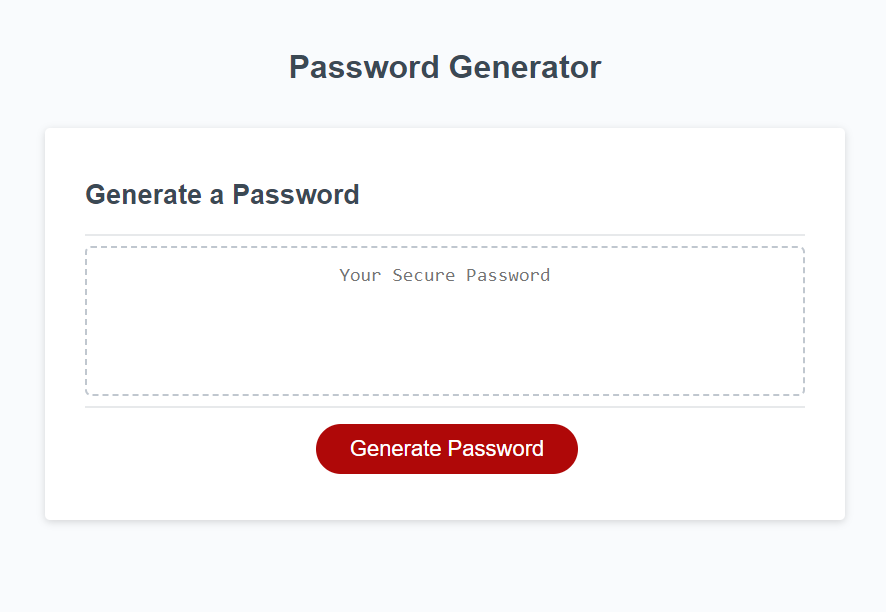

# password-generator

## Description
This program was built by Ethan Stone to create a randomly generated password based on criteria given by the user.

## Installation
N/A

## Usage
Use this website to create a random password based on criteria you choose. The password can be anywhere from 8 to 128 characters long and include at least one of the following: lower case letters, upper case letters, numbers, and special characters.

## Credits
Ethan Stone

## License
N/A